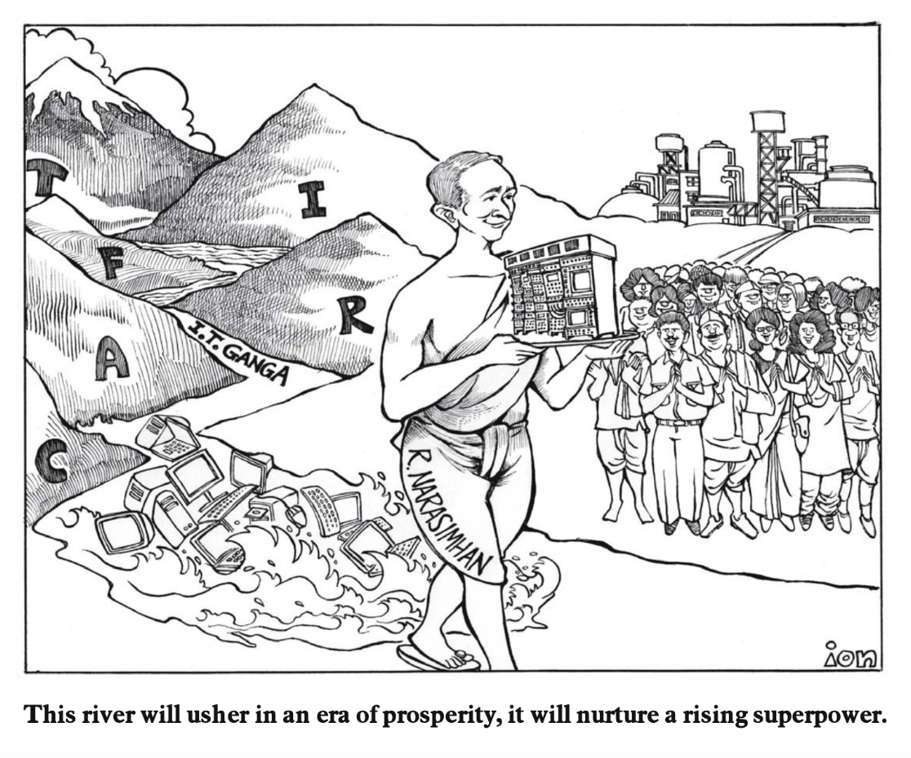

# Computing a Nation  
## TIFRAC and the Origins of Indian Computing

In the 1950s, a small team at the Tata Institute of Fundamental Research set out to build something no one in India had attempted before: a digital computer, designed and built entirely at home. This website explores the story of **TIFRAC**, India’s first indigenous computer — a machine born from Cold War geopolitics, Nehruvian dreams of self-reliance, and the audacity of scientific imagination.

---

---

## Explore the Project

- [India in 1960: Cold War, Independence, Nehruvian Science](india-1960.md)
- [The Project to Build a Computer](tifrac-project.md)
- [What Was TIFRAC?](tifrac-details.md)
- [Other Indian Computing Efforts](other-efforts.md)

  
  <footer>
    
&copy; 2025 Isa Sheikh

  </footer>
</body>
</html>
