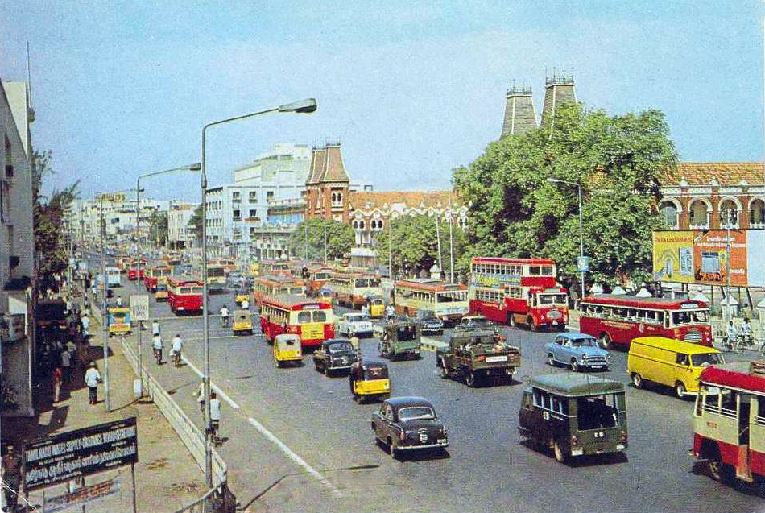

# India in 1960 — Independence, Cold War, Nehruvian Science

In 1960, India was a newly independent nation navigating the turbulent crosscurrents of Cold War geopolitics, postcolonial aspiration, and internal development. Prime Minister Jawaharlal Nehru envisioned science not merely as a tool for industrial growth, but as a foundation for national sovereignty. Institutions like the Tata Institute of Fundamental Research (TIFR), which Nehru called "the cradle of India’s nuclear energy programme," embodied this vision.

India's scientific elite, led by figures like Homi J. Bhabha, embraced a philosophy of technological self-reliance. “The ruling philosophy at that time,” recalled one TIFRAC designer, “was ‘do it here, do it ourselves’” (Rao, 421). The same drive that built the Apsara nuclear reactor inspired the quest for a domestically designed digital computer.

This ambition unfolded not in isolation, but against a backdrop of global competition. American military-funded computing projects remained cloaked in secrecy. Indian scientists “lacked access” to such developments and were “forced to stand on [their] own feet” — a handicap, but also “an opportunity to innovate” (Rao, 423). 

