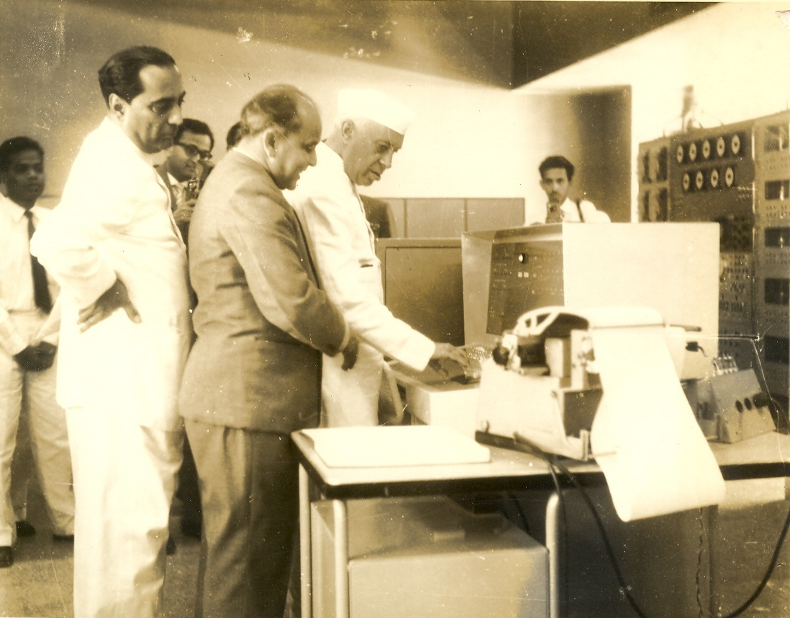

# Other Indian Efforts — Rivalries and Collaborations

While TIFRAC became the first indigenously built digital computer in India, it was not the only effort. The Indian Statistical Institute (ISI) in Calcutta, under Prasanta Chandra Mahalanobis, had also pursued computing since the early 1950s. But unlike Bhabha’s team, ISI had hoped to import machines from abroad — a plan complicated by Cold War geopolitics and bureaucratic delays.

By 1960, a rivalry had emerged between Bhabha and Mahalanobis over who would lead India's computing future. “Apart from having Nehru’s ear,” Bhabha also chaired the Atomic Energy Commission, giving him considerable sway (Menon, 451). Tensions culminated in letters exchanged in 1961, with Bhabha proposing joint lobbying for American computers — a suggestion Mahalanobis accepted, albeit pointedly reminding him that ISI’s efforts had begun earlier and were “urgently needed... for the efficient functioning of the planned economy” (Menon, 452).

TIFRAC, then, was not a lone victory — it was part of a broader and contested story of how India imagined, and fought over, the future of information.

